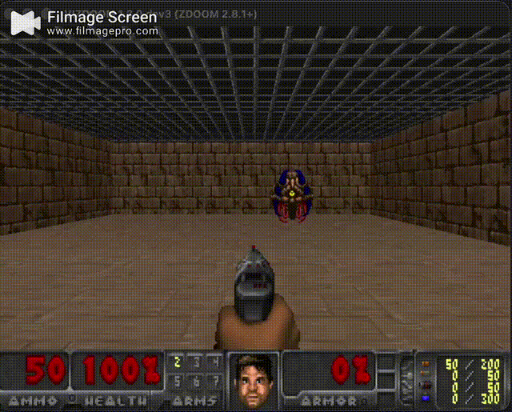
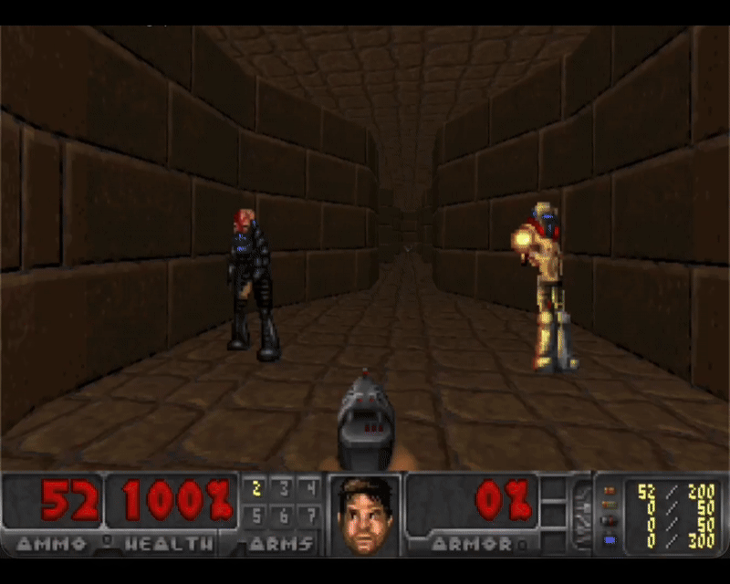

# RecurrentPPO-Cpp


<div style="display: flex; justify-content: center; gap: 20px;">
  
  
</div>

Recurrent PPO to solve Doom purely in CPP (Yuck). This is self-learning project.
I feel like it will be messy but it is what it is I guess!. 
The sources I followed:

1. Cleanrl : https://github.com/vwxyzjn/cleanrl/blob/master/cleanrl/ppo_atari_lstm.py#L310
2. StableBaselines3 : https://github.com/DLR-RM/stable-baselines3/blob/master/stable_baselines3/ppo/ppo.py
3. and SKRL for guidance and pseudo-code : https://skrl.readthedocs.io/en/latest/api/agents/ppo.html
4. My dear colleague's old medium post : https://medium.com/@mihai.anca13/exploring-opengl-physx-and-pytorch-all-in-c-8d8308a89cc6


##### Dependencies

## 1. General dependencies
```bash
sudo apt-get install clang clang++ gcc g++ cmake boost sdl2 openal-soft
```

or 

```bash
brew install clang clang++ gcc g++ cmake boost sdl2 openal-soft
```

### 2. `Libtorch 2.9.1`

Download and unzip in this project.

LINK FOR MACOS: https://download.pytorch.org/libtorch/cpu/libtorch-macos-arm64-2.9.1.zip

All the libtorch dists : https://download.pytorch.org/libtorch/cpu/?utm_source=chatgpt.com

2. `ViZDoom` (Good luck with dependencies on MACOS)

```bash
git clone https://github.com/Farama-Foundation/ViZDoom.git
cd ViZDoom
mkdir build && cd build

cmake .. \                                               
 -DCMAKE_BUILD_TYPE=Release \
 -DBUILD_ENGINE=ON \
 -DBUILD_PYTHON=OFF \
 -DCMAKE_OSX_ARCHITECTURES=arm64
  
make -j$(sysctl -n hw.ncpu)

cd ../..
```

## 3. Build the entire repo

`DO NOT FORGET TO RUN THIS FROM THE MAIN FOLDER OF THE PROJECT.`
```bash
mkdir build && cd build

cmake -DCMAKE_BUILD_TYPE=Release .. && cmake --build . -v
```

## 4. Run training

Maybe you should modify the `src/main.cpp` if you want to change the environment. Search for `train_ppo_run`/`train_ppo_rnn_run` function. Similar to StableBaselines.

```
./recurrent_ppo_cpp --operation train
```

or

```
./recurrent_ppo_cpp --operation train_rnn
```

It takes around 400-2000 episodes depending on the scenario with vanilla PPO (PPO-RNN 20-50 updates). Start with simple.wad. It is default.

## 4. Evaluate the trained agent

#### IMPORTANT : If you changed something in `train_ppo_run`/`train_ppo_rnn_run` function related to the agent or environment, do the same changes in `play_doom_ai_run`/`play_doom_ai_rnn_run` otherwise you will use apples to squeeze orange juice and you will be very very sad.

```
./recurrent_ppo_cpp --operation play_ai
```

or

```
./recurrent_ppo_cpp --operation play_ai_rnn
```

#### VSCode Setup 

`.vscode/c_cpp_properties.json`

```
{
    "configurations": [
        {
            "name": "Mac",
            "includePath": [
                "${workspaceFolder}/**",
                "/Library/Developer/CommandLineTools/usr/include/c++/v1", // C++ standard headers
                "/usr/local/include",
                "/usr/include",
                "CUSTOM_PATH_TO_PARENT/RecurrentPPO-Cpp/libtorch/include"
            ],
            "compilerPath": "/usr/bin/clang++", // Use Clang
            "cStandard": "c17",
            "cppStandard": "c++17",
            "intelliSenseMode": "macos-clang-arm64"
        }
    ],
    "version": 4
}
```

## How to contribute or read the code
- Start with running it. If you can train a vanilla PPO on basic.wad and run inference without any issues then you are ready for the next step.
- Check envs.hpp. I am not proud of that code but it is very similar to ViZDoom's C++ examples. Switch to another environment for example `deadly_corridor` or `defend_the_center` try to train Recurrent PPO this time.
- Experimentation is the key, change hyper-params and environment rewards. Start with high level engineering instead of playing with algorithm. Add some extra metrics to the environment since it interacts with the agents directly.
- Let's say you can train decent agents, now start playing with neural networks. Add or remove layers. Switch to GRU. Try continuous actions or sigmoid outputs. Don't forget, RecurrentPPO doesn't support separate networks so `a2c.hpp` is your friend. If you want to challenge yourself later, go ahead implement the separate_network version. I was just lazy. If you can update the network then you are already knowing your shit!
- Go ahead and checl `ppo.hpp` and `ppo_rnn` and play around. Good practice that I couldn't do is implementing the [`KL_Adaptive_Scheduler`](https://skrl.readthedocs.io/en/latest/api/resources/schedulers/kl_adaptive.html) or `entropy_annealing` which is constant and a little annoying at the moment.
- If you are still good and feeling resilient to stay in C++ realm, then you can do whatever you want. Fork the repo or make a PR with your changes. I have no tests. I will probably test it by trying your updates. Ahh if you want to add tests to the repo, you are always welcome.


## IMPORTANT! 

You should install only arm64 version of everything for macos. Also deal with the cmake.
I had to use CMake because libtorch and vizdoom is crying for cmake. 
If I could avoid, I would but it would just make the process 10x longer.
I am not a cmake master and I despise it to be very frank.
Maybe one day I will port everything to NOB and be happy.


## MAYBE IN THE FUTURE

[ ] Model-based training

[ ] Prioritized replay on segments instead of throwing everything. It is a waste just fyi.

[ ] Robust Policy Optimization

[ ] KL-Adaptive Learning rate and entropy scheduling

[ ] Multiple Environments

[ ] Multi-source inputs and structured outputs

[ ] Action Masking

[ ] Adaptive Reward Normalization.

[ ] Using pre-trained vision encoders.